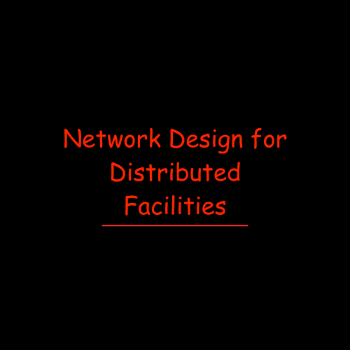

# 🚀 Simulated Scalable Network Infrastructure Design  
### 🏢 Multi-Branch Educational Institution | 🧠 Cisco Packet Tracer Simulation

  

---

## 💻 **Strategic Networking — Designed with Purpose, Simulated with Precision**  
I’m thrilled to introduce my latest technical showcase:  
**“Simulated Scalable Network Infrastructure Design”** — a fully mapped and configured **network simulation** created using **Cisco Packet Tracer**. Developed as part of the **EC4060 – Computer and Data Networks** module during my 4th semester at the *Faculty of Engineering, University of Jaffna*, this project demonstrates how real-world networking principles can be applied to solve complex, multi-site infrastructure challenges.

This end-to-end simulation reflects a **large-scale educational institution** comprising six separate branches — each with its own **dedicated subnet, VLANs, and device architecture** — built with future scalability and secure communication in mind.

---

  

---

## 🌍 **Project Overview**  
The goal of this simulation is to represent a **realistic, scalable, and secure network** infrastructure for an institution with:

- 📍 6 branches (5 academic + 1 administrative)
- 👨‍🏫 Segmentation between Staff and Students
- 📈 Future expansion built into design
- 🔄 Smooth data flow and connectivity between branches
- 🔒 Logical separation using VLANs
- ✅ Real-time testing using ping and traceroute tools

---

## 🎯 **Project Objectives**
- ✔️ Establish a robust, interconnected multi-branch network
- ✔️ Create **logical subnets and VLANs** based on user roles
- ✔️ Ensure **30% scalability** for future growth
- ✔️ Demonstrate **realistic testing and connectivity checks**

---

## 🌟 **Key Features**
- 🗂️ **Subnetting Table**: Includes all subnet IDs, usable IPs, and broadcast addresses
- 🧑‍🏫 **Staff vs. Student VLANs**: Every branch has role-based VLAN separation
- 📊 **Scalability Planning**: Each subnet includes 30% room for expansion
- 🔌 **Inter-Branch Communication**: Achieved via routers and routing tables
- 🧪 **Simulation Testing**: Connectivity validated using ping and traceroute commands
- 📹 **Walkthrough Video**: Includes a step-by-step visual of the design and results

---

## 🧰 **Technologies Used**
- 💻 Cisco Packet Tracer
- 🌐 IP Subnetting & VLAN Design
- ⚙️ Inter-VLAN Routing
- 🔐 Secure Logical Segmentation
- 🧾 Network Configuration Scripts
- 📽️ Video Demonstration & Reporting

---

## 📂 **Repository Content**
- `Simulated_Scalable_Network.pkt` → Cisco Packet Tracer simulation file  
- `Subnet_Table.pdf` → Detailed IP addressing plan  
- `VLAN_Config.txt` → Configuration commands  
- `Testing_Results.pdf` → Ping/traceroute validation  
- `Simulation_Walkthrough.mp4` → Project demonstration  
- `Readme.md` → You’re reading it!

---

## 📈 **Skills Demonstrated**
As a 2nd-year **Computer Engineering undergraduate**, this project reflects my:

- 🔧 Technical expertise in **network design and simulation**
- 🎯 Precision in **IP planning and segmentation**
- 🧠 Logical thinking and problem-solving with real-world scenarios
- ✍️ Professional documentation and project storytelling

---

## 🌱 **Why This Project Matters**
In an era where **digital infrastructure powers education and innovation**, simulating **intelligent and scalable network systems** is more relevant than ever. This project showcases how thoughtful design and real-world configurations can prepare us to **build the next generation of smart institutions**.

---

## 🔗 **Check Out the Project**
👉 [Live Repository on GitHub](https://github.com/Don/Simulated_Scalable_Network_Design)

📹 **Video Walkthrough**  
Watch the full demonstration of design logic, implementation, and testing in action.

---

## 🤝 **Let’s Connect**
💬 Interested in collaborating on network projects, simulations, or educational platforms?  
I’m always excited to connect with engineers, developers, and tech enthusiasts.

> 🔧 Crafted with care by **Don Dew**  
> 📬 Reach me on [LinkedIn](https://www.linkedin.com/in/don-dew) or drop a ⭐ if you found this helpful!

  

